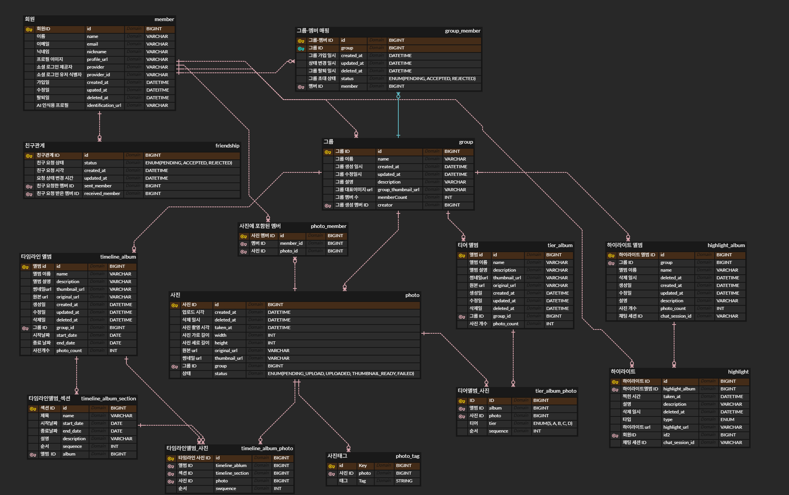
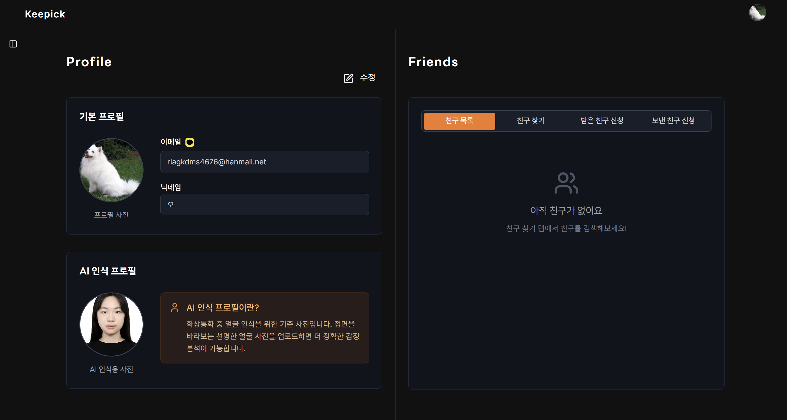
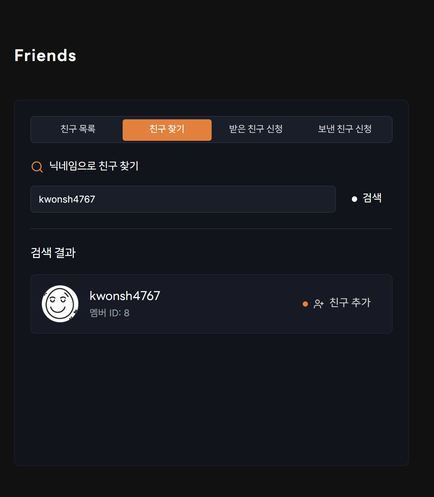
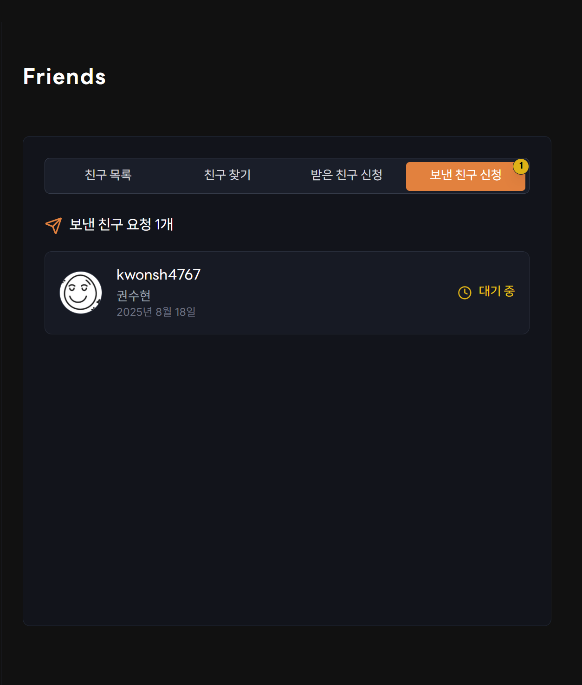
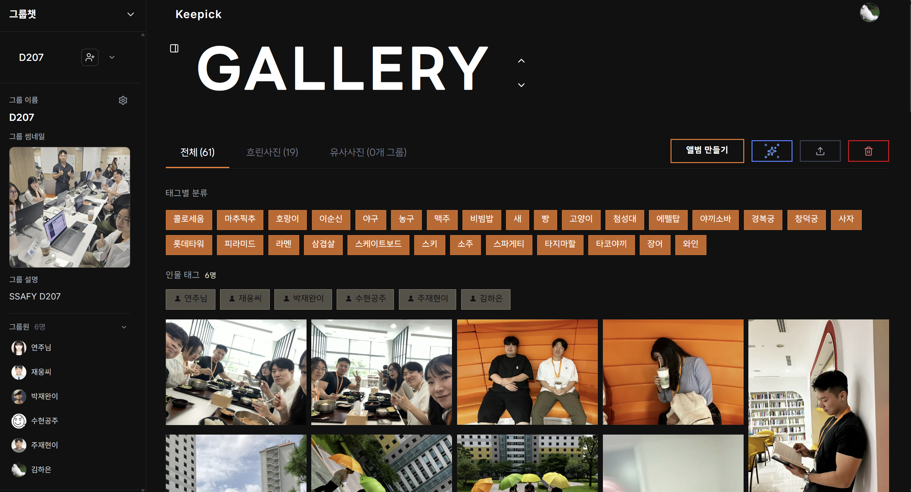

# Keepick 프로젝트 포팅 매뉴얼

## 1. GitLab 소스 클론 이후 빌드 및 배포 문서

### 1-1. 개발/운영 환경 정보

- **JVM**: OpenJDK 21
- **웹 서버(Web Server)**: Nginx 1.24
- **WAS**: Spring Boot 내장 Tomcat
- **IDE**: IntelliJ IDEA 2024.1 (Community Edition)
- **Build Tool**: Gradle
- **OS 환경**: Ubuntu 22.04 LTS (운영 서버), Windows 11 (개발 환경)

### 1-2. 빌드 시 환경 변수

#### Spring Boot 환경 변수
```bash
# 데이터베이스 설정 (MySQL)
DB_PATH=db_url
DB_USERNAME=db_username
DB_PASSWORD=db_password

# JWT 보안 설정
JWT_SECRET=*****************************************************
JWT_EXPIRED_MS=86400000

# OAuth2 소셜 로그인 - 카카오
KAKAO_CLIENT_ID=kakao_client_id
KAKAO_REDIRECT_URI=https://{domain}/login/oauth2/code/kakao

# OAuth2 소셜 로그인 - 네이버
NAVER_CLIENT_ID=naver_client_id
NAVER_CLIENT_SECRET=naver_client_secret
NAVER_REDIRECT_URI=https://{domain}/login/oauth2/code/naver

# OAuth2 소셜 로그인 - 구글
GOOGLE_CLIENT_ID=google_client_id
GOOGLE_CLIENT_SECRET=google_client_secriet
GOOGLE_REDIRECT_URI=https://{domain}/login/oauth2/code/google

# Redis 설정
REDIS_HOST=localhost
REDIS_PORT=6379

# 기타 설정
COOKIE_MAX_AGE=86400
FRONTEND_URL=https://{domain}
DEV_URL=https://{domain}
VISION_AI_URL=http://{domain}:5000

# AWS 설정
AWS_REGION=aws_region
AWS_ACCESS_KEY_ID=aws_access_key
AWS_SECRET_ACCESS_KEY=aws_secret_key
S3_BUCKET_NAME=keepick-bucket
SQS_QUEUE_NAME=keepick-message-queue
```

#### Next.js 환경 변수
```bash
NEXT_PUBLIC_API_BASE_URL='https://{domain}'
```

### 1-3. 배포 시 특이사항

### 1-4. DB 접속 정보 등 프로젝트(ERD)에 활용되는 주요 계정 및 프로퍼티가 정의된 파일 목록

#### application.yml
- DB 접속 계정, Redis 설정, AWS Key, 소셜 로그인 key 등 정의

#### docker-compose.yml
```yaml
version: '3.8'
services:
  app:
    image: project-app:latest
    build: .
    ports:
      - "8080:8080"
    environment:
      SPRING_PROFILES_ACTIVE: prod
      DB_URL: ${DB_URL}
      DB_USERNAME: ${DB_USERNAME}
      DB_PASSWORD: ${DB_PASSWORD}
      REDIS_HOST: redis
      AWS_S3_BUCKET: keepick-bucket
      AWS_ACCESS_KEY: ${AWS_ACCESS_KEY}
      AWS_SECRET_KEY: ${AWS_SECRET_KEY}
    depends_on:
      - db
      - redis

  db:
    image: mysql:8.0
    environment:
      MYSQL_DATABASE: keepick
      MYSQL_USER: ${DB_USERNAME}
      MYSQL_PASSWORD: ${DB_PASSWORD}
      MYSQL_ROOT_PASSWORD: ${DB_ROOT_PASSWORD}
    ports:
      - "3306:3306"

  redis:
    image: redis:7.2
    ports:
      - "6379:6379"
```

#### 빌드 및 실행 명령어
```bash
# Gradle 빌드
./gradlew clean build -x test

# Docker 이미지 빌드
docker build -t project-app:latest .

# Docker 이미지 실행
docker run -d
```

## 2. 외부 서비스 정보

**소셜 로그인 (OAuth2)**
- Google, Kakao, Naver Client ID/Secret 필요
- Redirect URI: `https://{domain}/login/oauth2/code/{provider}`

## 3. DB 덤프 파일 최신본

- workbench에서 reverse 엔지니어링



## 4. 시연 시나리오

### 4-1. 홈 페이지

### 4-2. 소셜 로그인 (Google, Naver, Kakao)
- 홈페이지 우측 상단 로그인 버튼
- 로그인 후 프로필 버튼으로 바뀜
- 좌측 사이드바로 그룹 목록 및 생성 사이드바 생성


### 4-3. 프로필 페이지
- 좌측 화면의 수정 버튼 클릭하여 기본 프로필 이미지, AI 인식 프로필, 닉네임 수정
- 우측 화면의 친구 페이지에서 친구 닉네임으로 검색하여 친구 신청




### 4-4. 그룹 갤러리

- 사진 업로드 → ai 분석 영상 (진행상황 알림)
- 흐린, 유사한 사진 필터링
- 태그 필터링 영상
[그룹갤러리2](assets/그룹갤러리2.mp4)


### 4-5. 티어 앨범
- 사진 선택해서 티어 앨범 만드는 영상 + 배틀 모드

[티어 앨범 시연 영상](assets/티어앨범.mp4)

### 4-6. 타임라인 앨범
- 사진 선택해서 타임라인 앨범 만드는 영상

[타임라인 앨범 시연 영상](assets/타임라인앨범.mp4)

### 4-7. 그룹챗
- 그룹챗 실시간 이모티콘 전송
- 텍스트 채팅

[그룹챗 시연 영상](assets/그룹챗.mp4)

## 5. 첨부파일

### 5-1. 첨부파일 위치
- 모든 첨부파일은 `exec/assets/` 폴더에 저장
- 이미지 파일: PNG, JPG, WEBP 형식
- 영상 파일: MP4 형식

### 5-2. 첨부파일 목록
- ERD 이미지: `assets/erd-diagram.png`
- 시연 이미지들: `assets/` 폴더 내
  - 소셜 로그인 시연: `시연시나리오2-1.png`, `시연시나리오2-2.png`
  - 프로필 페이지 시연: `시연시나리오3-1.png`, `시연시나리오3-2.png`, `시연시나리오3-3.png`
  - 그룹 갤러리 시연: `그룹갤러리1.png`
- 시연 영상들: `assets/` 폴더 내
  - 그룹 갤러리 시연: `그룹갤러리2.mp4`
  - 티어 앨범 시연: `티어앨범.mp4`
  - 타임라인 앨범 시연: `타임라인앨범.mp4`
  - 그룹챗 시연: `그룹챗.mp4`

### 5-3. 첨부파일 참조 방법
```markdown
# 이미지 표시


# 영상 링크 (클릭하여 다운로드/재생)
[그룹 갤러리 시연 영상](assets/그룹갤러리2.mp4)
```
